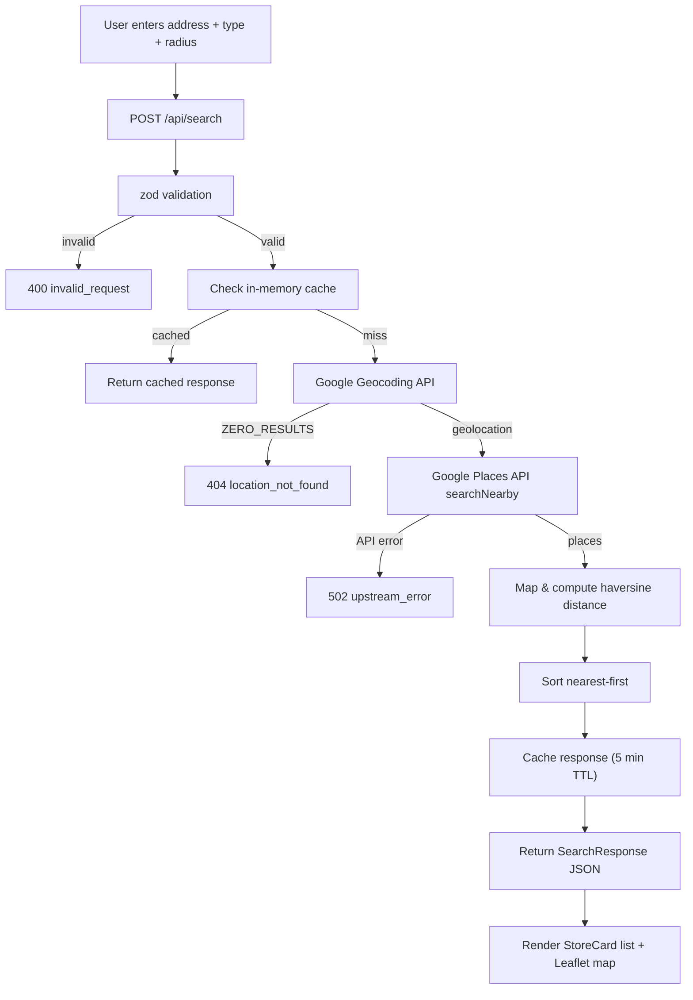

# Store Locator

Find nearby stores by address or PIN code. Enter a location, pick a store type (pharmacy, grocery, electronics, restaurant, clothing) and a search radius (2–20 km) — get a list of stores with distance, phone, opening hours, open/closed status, rating, website, a directions link, and markers on a map.

Search results can be downloaded from the results header as either a CSV file or an Excel (`.xlsx`) workbook.

## Tech Stack

- **Framework & Core:** [Next.js](https://nextjs.org/) (App Router), [React](https://react.dev/), [TypeScript](https://www.typescriptlang.org/)
- **Styling:** [Tailwind CSS](https://tailwindcss.com/)
- **Maps & Location Services:** [Leaflet](https://leafletjs.com/) & [React Leaflet](https://react-leaflet.js.org/) (with OpenStreetMap tiles), [Google Geocoding API](https://developers.google.com/maps/documentation/geocoding), [Google Places API (New)](https://developers.google.com/maps/documentation/places/web-service)
- **Validation & Logic:** [Zod](https://zod.dev/), In-memory TTL Cache, Haversine distance calculations
- **Exporting Data:** [`write-excel-file`](https://www.npmjs.com/package/write-excel-file) (Excel `.xlsx`), Native CSV generation
- **Testing & Code Quality:** [Vitest](https://vitest.dev/), [ESLint](https://eslint.org/)

## How it works



- The browser only talks to `POST /api/search`. Everything else runs server-side.
- The Google API key lives only in `.env.local` — never sent to the browser.
- The map uses **Leaflet + OpenStreetMap tiles** (free, no key needed).

## Setup

### 1. Google Cloud

1. Create a project at [console.cloud.google.com](https://console.cloud.google.com) (billing must be enabled — the monthly free credit easily covers development use).
2. Enable two APIs: **Geocoding API** and **Places API (New)**.
3. Create an API key (APIs & Services → Credentials). Recommended: restrict it to those two APIs.

### 2. Environment

Create `.env.local` in the project root:

```
GOOGLE_MAPS_API_KEY=your_key_here
```

### 3. Run

```bash
npm install
npm run dev      # http://localhost:3000
```

## Scripts

| Command | What |
|---|---|
| `npm run dev` | dev server |
| `npm run build` | production build |
| `npm test` | unit tests (vitest) |

## Project structure

```
src/
├── app/
│   ├── page.tsx              # main page: search state, list + map layout
│   └── api/search/route.ts   # POST endpoint: validate → geocode → search → respond
├── lib/
│   ├── types.ts              # Store, SearchRequest, SearchResponse
│   ├── distance.ts           # haversine distance
│   ├── validation.ts         # zod request schema
│   ├── google.ts             # Geocoding + Places API calls (server-only)
│   ├── mapper.ts             # Google place → Store
│   └── cache.ts              # in-memory TTL cache
└── components/
    ├── SearchForm.tsx        # address input, type select, radius slider
    ├── StoreCard.tsx         # one result card
    ├── StoreList.tsx         # result list
    └── StoreMap.tsx          # Leaflet map with markers
```

## API errors

| Response | Meaning |
|---|---|
| 400 `invalid_request` | bad input (empty query, unknown type, radius outside 2–20) |
| 404 `location_not_found` | address/PIN could not be geocoded |
| 502 `upstream_error` | Google API failure (bad key, quota, outage) |
